 

&nbsp;

  

  

**[امکانات](#-امکانات)** &nbsp;·&nbsp; **[نصب](#-نصب)** &nbsp;·&nbsp; **[میان‌برها](#️-میانبرها)** &nbsp;·&nbsp; **[حریم خصوصی](#-حریم-خصوصی)** &nbsp;·&nbsp; **[سؤالات](#-سؤالات-رایج)** &nbsp;·&nbsp; **[مشارکت](#-مشارکت)**

<h2 align="center">موسیقی تو. کتابخانهٔ تو. تجربهٔ تو.</h2>

<b>NOVA</b> یه موزیک‌پلیر مدرن برای ویندوزه که فایل‌های خودت رو با ظاهری سینمایی پخش می‌کنه. 
بدون اینترنت، بدون تبلیغ، بدون حساب کاربری. آهنگ‌هات فقط مال خودتن.

 

| ⚡ سبک و سریع | 🔒 کاملاً آفلاین | 🎨 طراحی سینمایی | 💚 متن‌باز و رایگان |
|:---:|:---:|:---:|:---:|
| ساخته‌شده با Tauri و Rust | هیچ داده‌ای از سیستمت خارج نمی‌شه | Glassmorphism، نئون و موشن نرم | برای همیشه، بدون قید و شرط |

## ✨ امکانات

<b>🎧 پخش و کتابخانه</b>

 

- **آپلود فایل، پوشه یا Drag & Drop:** کل آرشیو موسیقی‌ات رو یه‌جا اضافه کن
- **نمایش خودکار کاور** از تگ ID3v2 فایل‌های MP3
- **جستجوی لحظه‌ای** بین نام آهنگ‌ها و پوشه‌ها
- **مرتب‌سازی** بر اساس نام، جدیدترین، حجم یا ترتیب دستی با کشیدن (⠿)
- **پخش تصادفی** و سه حالت تکرار: یک آهنگ، کل لیست، خاموش

<b>🎬 تجربهٔ سینمایی</b>

 

- **حالت سینمایی:** دیسک بزرگ چرخان با نور کاور، کتابخانه کنار می‌ره
- **حلقهٔ صدا** که به فرکانس‌های واقعی آهنگ واکنش نشون می‌ده
- **ویژوالایزر زنده** با Web Audio API
- **انیمیشن‌های نرم** با شتاب طبیعی موقع شروع و توقف

<b>🎤 متن هم‌زمان (LRC)</b>

 

- برای هر آهنگ فایل `.lrc` خودت رو اضافه کن
- متن خط‌به‌خط همراه آهنگ جلو می‌ره؛ روی هر خط بزنی، آهنگ می‌ره همون‌جا
- تنظیم دقیق زمان‌بندی با `−0.5s` و `+0.5s`
- دریافت خودکار از اینترنت نداره؛ همه‌چیز محلیه

<b>🪟 مینی‌پلیر، پلی‌لیست و شخصی‌سازی</b>

 

- **مینی‌پلیر شناور** روی بقیهٔ برنامه‌ها (همیشه در بالا)
- **پلی‌لیست‌های نامحدود** با تغییر نام، حذف و افزودن گروهی
- **علاقه‌مندی‌ها** ♥ برای دسترسی سریع
- **قفسهٔ کاورها:** آهنگ‌های هم‌آلبوم کنار هم، مثل ورق زدن صفحهٔ وینیل
- **تم تیره و روشن** و **حالت کاهش حرکت** برای دسترس‌پذیری
- **ذخیرهٔ دائمی:** بعد از بستن و باز کردن، همه‌چیز سر جاشه

 

**فرمت‌های پشتیبانی‌شده**

## 📥 نصب

<table>
<tr>
<td width="50%" valign="top">

### 🪟 نسخهٔ ویندوز &nbsp;پیشنهادی

1. برو به **[آخرین ریلیز](https://github.com/Mehdi138iimm/NovaPlayer/releases/latest)**
2. فایل نصبی (`.exe` یا `.msi`) رو دانلود کن
3. اجراش کن و آهنگ‌هات رو بکش توی برنامه

</td>
<td width="50%" valign="top">

### 🌐 نسخهٔ وب &nbsp;بدون نصب

1. **[NOVA Web](https://mehdi138iimm.github.io/NovaPlayer/)** رو باز کن
2. بهترین تجربه روی Chrome یا Edge دسکتاپ
3. فایل‌ها داخل مرورگر خودت ذخیره می‌شن

</td>
</tr>
</table>

> [!TIP]
> اگه ویندوز پیام **SmartScreen** نشون داد، روی **More info** و بعد **Run anyway** بزن. این برای برنامه‌های متن‌بازِ بدون امضای دیجیتال طبیعیه.

## ⌨️ میان‌برها

| کلید | عملکرد | | کلید | عملکرد |
|:---:|:---|:---:|:---:|:---|
| <kbd>Space</kbd> | پخش / مکث | | <kbd>C</kbd> | حالت سینمایی |
| <kbd>←</kbd> <kbd>→</kbd> | آهنگ قبلی / بعدی | | <kbd>L</kbd> | متن آهنگ |
| <kbd>↑</kbd> <kbd>↓</kbd> | کم و زیاد کردن صدا | | <kbd>D</kbd> | مینی‌پلیر شناور |
| <kbd>Esc</kbd> | خروج از سینما | | | |

## 🔒 حریم خصوصی

NOVA **هیچ** داده‌ای جمع نمی‌کنه. نه آنالیتیکس، نه ردیابی، نه سرور. آهنگ‌ها، پلی‌لیست‌ها و متن‌ها فقط روی سیستم خودت ذخیره می‌شن و برنامه برای کار کردن به اینترنت نیاز نداره.

## 🛠️ ساخته‌شده با

<b>Tauri 2</b> · <b>Rust</b> · <b>Web Audio API</b> · <b>ID3v2</b> · <b>IndexedDB</b>

## ❓ سؤالات رایج

<b>آیا NOVA رایگانه؟</b>

 
بله، کاملاً رایگان و متن‌بازه. بدون تبلیغ، بدون نسخهٔ پولی.

<b>آهنگ‌هام کجا ذخیره می‌شن؟</b>

 
فقط روی سیستم خودت. هیچ فایلی آپلود یا به جایی ارسال نمی‌شه.

<b>متن آهنگ رو از کجا بیارم؟</b>

 
NOVA از فایل‌های <code>.lrc</code> استفاده می‌کنه. آهنگ رو انتخاب کن، <kbd>L</kbd> رو بزن و «افزودن LRC» رو انتخاب کن.

<b>کاور آهنگم نمایش داده نمی‌شه، چرا؟</b>

 
کاور از داخل تگ ID3v2 فایل خونده می‌شه. اگه فایل کاور جاسازی‌شده نداشته باشه، آیکون پیش‌فرض نمایش داده می‌شه.

## 🤝 مشارکت

از هر نوع کمکی استقبال می‌کنیم:

- 🐛 **[گزارش باگ](https://github.com/Mehdi138iimm/NovaPlayer/issues/new)** با توضیح مراحل و اسکرین‌شات
- 💡 **[پیشنهاد ایده](https://github.com/Mehdi138iimm/NovaPlayer/issues/new)** برای امکانات جدید
- 🔧 **Pull Request:** ریپو رو Fork کن، روی یه برنچ جدا تغییر بده و PR بفرست

 

### ⭐ اگه NOVA رو دوست داشتی، با یه ستاره حمایتش کن

<a href="https://star-history.com/#Mehdi138iimm/NovaPlayer&Date">
  <picture>
    <source media="(prefers-color-scheme: dark)" srcset="https://api.star-history.com/svg?repos=Mehdi138iimm/NovaPlayer&type=Date&theme=dark">
    
  </picture>
</a>

## 👥 سازنده‌ها

<table>
<tr>
<td align="center" width="200">
<a href="https://github.com/Mehdi138iimm">  <b>Mehdi Jafari</b></a> مهدی جعفری
</td>
<td align="center" width="200">
<a href="https://github.com/kasragfxdx">  <b>Kasra Ghelichi</b></a> کسری قلیچی
</td>
</tr>
</table>

  

Made with 💚 in Iran &nbsp;·&nbsp; Open Source &nbsp;·&nbsp; Offline First

